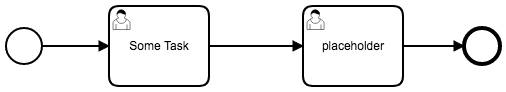
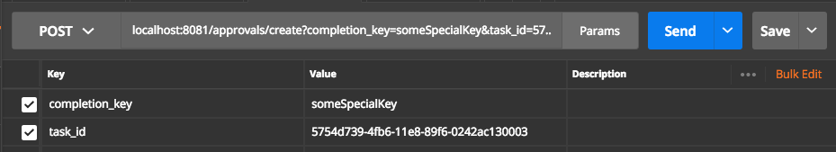
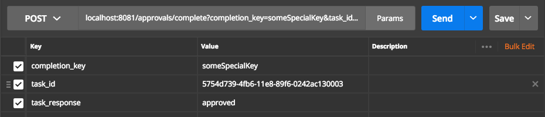
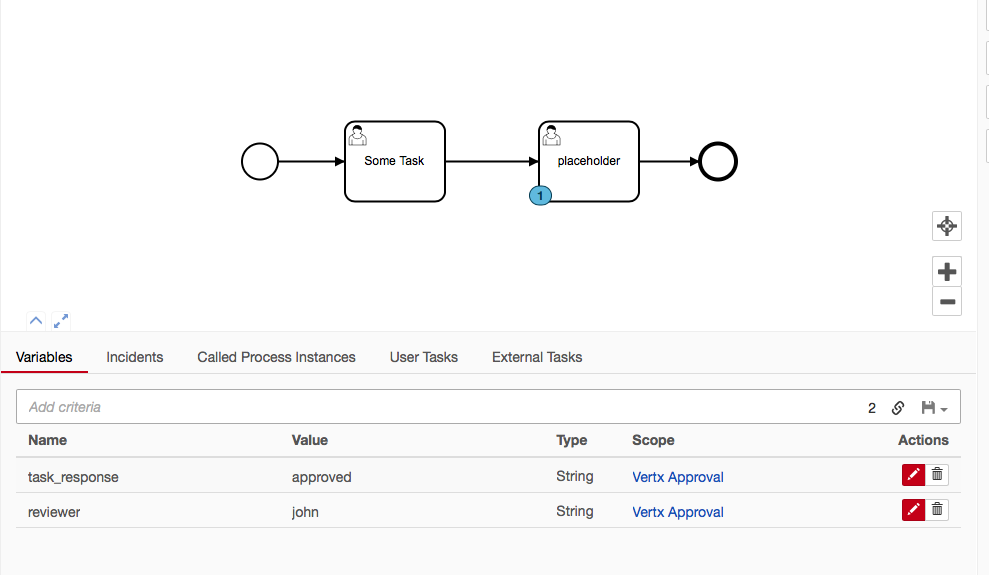

# Camunda BPM Process Engine Plugin for Vertx

This is a Process Engine Plugin for Camunda BPM that creates a Vertx instance within the Camunda application.  This is useful when you want to use Vertx but with a shared engine configuration of Camunda such as the default Camunda docker container.

You can deploy a verticle in any of the supported Vertx languages such as:

1. Javascript
1. Groovy
1. Ruby
1. Java
1. Kotlin
1. Scala

# Requirements

1. Java 8
1. Tested with Camunda BPM 7.8 Tomcat
1. Tested with Vertx 3.5.1 (this is what is in the Plugin Jar)


# How to use

See the docker folder for a working example of the plugin and a Javascript / Nashorn verticle.

## Plugin setup

```xml
<plugin>
    <class>io.digitalstate.camunda.CamundaVertxPluginProcessEnginePlugin</class>
    <properties>
        <!-- <property name="vertxOptionsPath">/VertxConfigs/vertx_instance_config.json</property> -->
        <property name="vertxVerticlesYmlPath">/VertxConfig/verticles.yaml</property>
    </properties>
</plugin>
```


The plugin supports two properties:

1. `vertxOptionsPath`: the absolute path to a json file that defines the configurations of the Vertx Instance.

1. `vertxVerticlesYamlPath`: the absolute path to the yaml file defining the other verticles to deploy.


In most cases you will only need to provide the vertxVerticlesYmlPath property, as the default Vertx Instance configurations are good enough for most cases.


## verticles.yaml

a verticles yaml file must be provided that defines which verticles to deploy.

On startup of the plugin, the plugin will generate the Vertx Instance, and then deploy a Java based "main verticle".  This main verticle will read from the defined verticles yaml file and deploy the other verticles defined.

Yaml file example:

```yaml
# Verticle Configurations
verticles:
    my_verticle_steve:
        name: "my verticle steve"
        path: "/verticles/vert1/vert1.js"
        deployment_options:
          worker: false
          instances: 1
          # isolationGroup:
          # isolatedClasses:
          config:
              value1: "dog"
              value2: "cat"
```

The path of the verticle file is defined in the Plugins properties configuration in the bpm-platform.xml file:

```xml
<plugin>
    <class>io.digitalstate.camunda.CamundaVertxPluginProcessEnginePlugin</class>
    <properties>
        <!-- <property name="vertxOptionsPath">/VertxConfigs/vertx_instance_config.json</property> -->
        <property name="vertxVerticlesYmlPath">/VertxConfig/verticles.yaml</property>
    </properties>
</plugin>
```

The plugin supports two properties:

1. `vertxOptionsPath`: the absolute path to a json file that defines the configurations of the Vertx Instance.

1. `vertxVerticlesYamlPath`: the absolute path to the yaml file defining the other verticles to deploy.

# Sample Verticle

see the sample verticle in `./docker/volumes/Verticles/vert1/vert1.js`.  This is a very raw example of a Javascript verticle.

# Process Engine Class

A simple helper class is generated on post engine build that contains a instance of the ProcessEngine.  It can be used by other verticles.

Example in a Javascript verticle you can do the following:

```js
var processEngine = Java.type("io.digitalstate.camunda.CamundaVertxPluginProcessEngine").getProcessEngine()
console.log("Process Engine: " + processEngine.getName())

var activeProcessInstanceCount = processEngine.getRuntimeService()
                                              .createProcessInstanceQuery()
                                              .active()
                                              .count()
console.log('Active Process instance Count: ' + activeProcessInstanceCount)
```

# Vertx Libs currently included:

The currently default libraries included for vertx are:

```xml
<dependency>
    <groupId>io.vertx</groupId>
    <artifactId>vertx-core</artifactId>
    <version>3.5.1</version>
</dependency>

<dependency>
    <groupId>io.vertx</groupId>
    <artifactId>vertx-config-yaml</artifactId>
    <version>3.5.1</version>
</dependency>

<dependency>
    <groupId>io.vertx</groupId>
    <artifactId>vertx-config</artifactId>
    <version>3.5.1</version>
</dependency>

<dependency>
    <groupId>io.vertx</groupId>
    <artifactId>vertx-lang-js</artifactId>
    <version>3.5.1</version>
</dependency>

<dependency>
    <groupId>io.vertx</groupId>
    <artifactId>vertx-web</artifactId>
    <version>3.5.1</version>
</dependency>
```


# Use Case - Web Service for Task Approvals/Completion

The following is a example of a Web Service being created for Task approvals.
Where through a POST you can "create" a approval and then "complete" the approval.  The approval endpoints are protected by a "completion_key" that you defined when creating the approval.

When you POST the completion you provide a task response which is a variable value that is injected into the process.

This is a useful scenario to provide Email based task completion.

In this use case we use Redis to store the Approvals objects.  We use Jedis to communicate with Redis.  See the docker folder and the docker-compose.yml file for further configuration details.

## Screenshots




`localhost:8081/approvals/create?completion_key=someSpecialKey&task_id=5754d739-4fb6-11e8-89f6-0242ac130003`


`localhost:8081/approvals/complete?completion_key=someSpecialKey&task_id=5754d739-4fb6-11e8-89f6-0242ac130003&task_response=approved`




Response times are sub 150ms


## Verticle Javascript

See the vert1.js file or see the following:

**Note:** this is a very quick implementation that has very little error handling.

**Note about Jedis Usage:** the Java lib Jedis is used for access to Redis in our example below. The usage of Jedis is used instead of the Vertx Redis client because the goal was to make the usage of Redis access as "copy and paste-able" into a Camunda Script Task, as possible.  In proper practice you would use the Vertx redis client rather than Jedis.  Therefore do not look at the use of "`executeBlocking()`" functions as "proper practice" in the context of Vertx usage.

```js
exports.vertxStart = function() {
 console.log("This is a Javascript Vertx Verticle Running")
}

var processEngine = Java.type("io.digitalstate.camunda.CamundaVertxPluginProcessEngine").getProcessEngine()
console.log("Process Engine: " + processEngine.getName())

var activeProcessInstanceCount = processEngine.getRuntimeService()
                                              .createProcessInstanceQuery()
                                              .active()
                                              .count()
console.log('Active Process instance Count: ' + activeProcessInstanceCount)

//-----------------------------------

// the 'vertx' variable is already provided by Vertx.

var Router = require("vertx-web-js/router");
var server = vertx.createHttpServer();
var router = Router.router(vertx);

router.route('POST', '/approvals/create').handler(function (routingContext) {
  
  var completionKey = routingContext.request().getParam("completion_key");
  var taskId = routingContext.request().getParam("task_id");

  approvalCreate(taskId, completionKey)
  
  var response = routingContext.response();
  response.putHeader("content-type", "text/plain");
  response.setStatusCode(201)
          .end("created");
});

router.route('POST', '/approvals/complete').handler(function (routingContext) {
  
  var completionKey = routingContext.request().getParam("completion_key");
  var taskId = routingContext.request().getParam("task_id");
  var taskResponse = routingContext.request().getParam("task_response");
  
  approvalComplete(taskId, completionKey, taskResponse)

  var response = routingContext.response();
  response.putHeader("content-type", "text/plain");
  response.setStatusCode(201)
          .end("completed");
});

// Startup the Server!!
server.requestHandler(router.accept).listen(8081);


//
// Helper Functions:
//

function approvalCreate(taskId, completionKey){
  var Jedis = Java.type('redis.clients.jedis.Jedis')
  var jedis = new Jedis("redisdb")

  vertx.executeBlocking(function (future) {
    var jedisRes = jedis.set(taskId, completionKey)

    future.complete(jedisRes);
  }, function (res, res_err) {
    console.log("Redis returned the following: " + res)
    console.log('Redis Data: ' + jedis.get(taskId))
  });
}

function approvalComplete(taskId, completionKey, taskResponse){
  var Jedis = Java.type('redis.clients.jedis.Jedis')
  var jedis = new Jedis("redisdb")
  
  vertx.executeBlocking(function (future) {
    var jedisRes = jedis.get(taskId)
    if (jedisRes != completionKey){
      future.fail("invalid completion key")
    } else {
      taskComplete(taskId, taskResponse)
      future.complete("task complete");
    }

  }, function (res, res_err) {
    if (res_err == null){
      console.log("Approval Complete returned the following: " + res);
    } else {
      console.log('Error Response: ' + res_err)
    }
  });
}

function taskComplete(taskId, taskResponse){
  // Uses Java.asJSONCompatiable to ensure that the JSON 
  // object is returned to Camunda as a Map<String, Object> 
  // as per required by the complete() method.
  processEngine.getTaskService()
               .complete(taskId, Java.asJSONCompatible(
                                              {
                                                'task_response': taskResponse,
                                                'reviewer': "john"
                                              }))
}
```